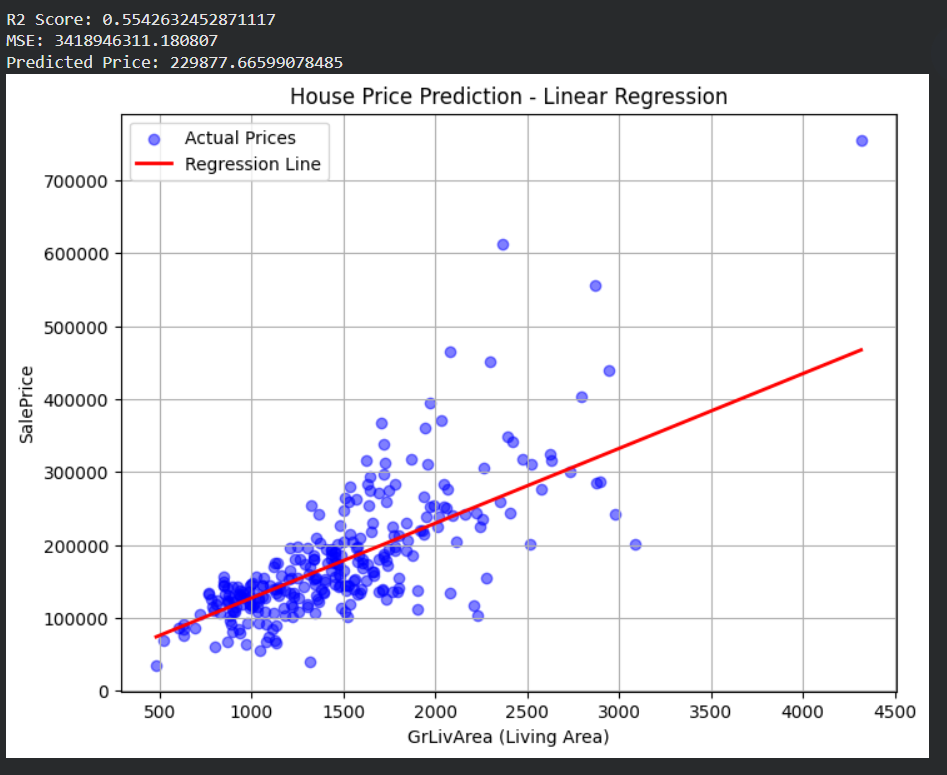
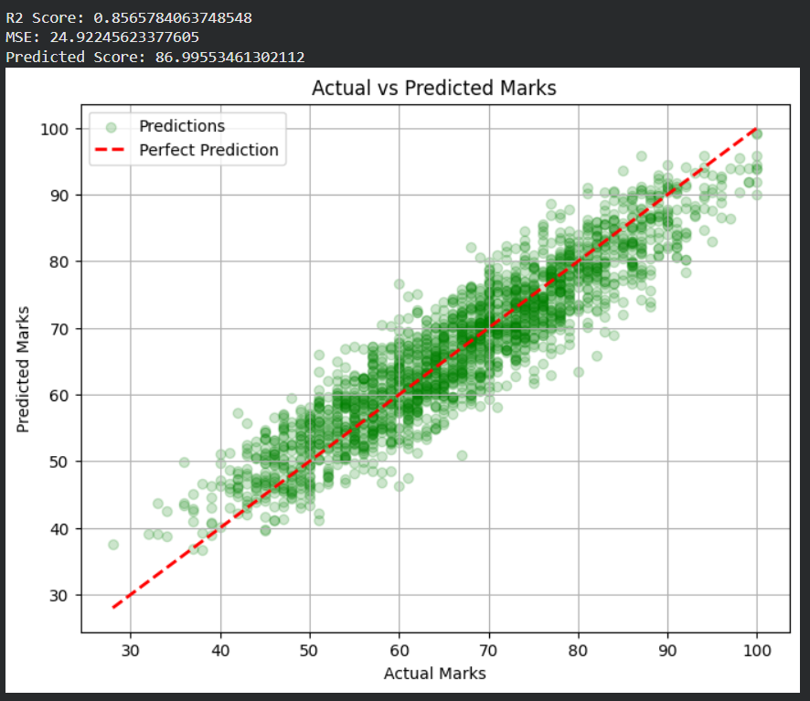

# Day 2

# Output for each Program 

## Using linear Regression

<p align="center">
  
</p>

## Using Logistic Regression 
```text
 Accuracy: 0.7374301675977654
 Confusion Matrix:
 [[93 12]
 [35 39]]
 Passenger Survived
```
## using Linear Regression on student marks  

<p align="center">
  
</p>

## using Logistic Regression on student marks 
```text
 Accuracy: 0.9915

 Confusion Matrix:
 [[   8   15]
 [   2 1975]]
 Pass Prediction: 1
 Probability of Pass: 0.9999999851787986
```