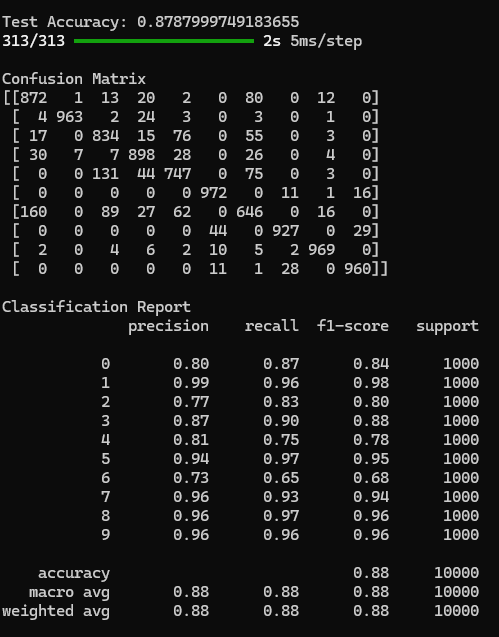
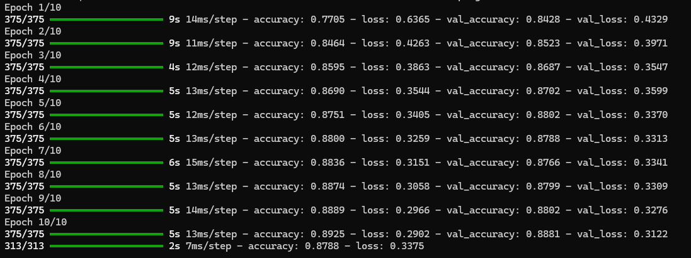
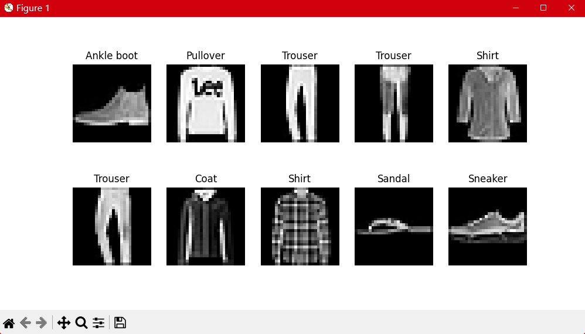
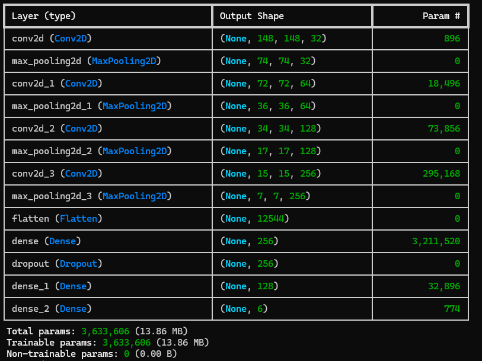
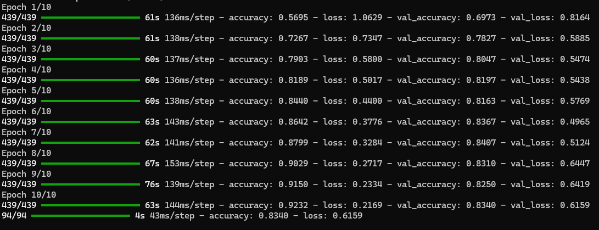
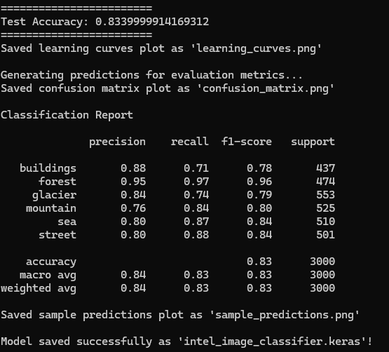
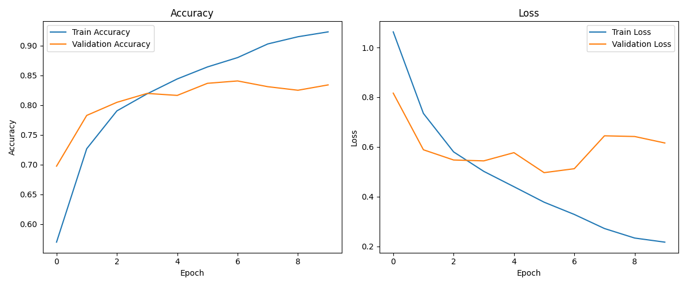
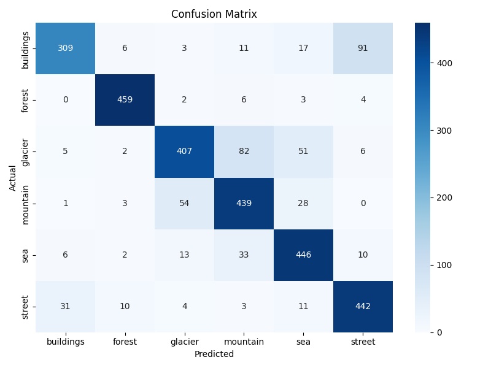
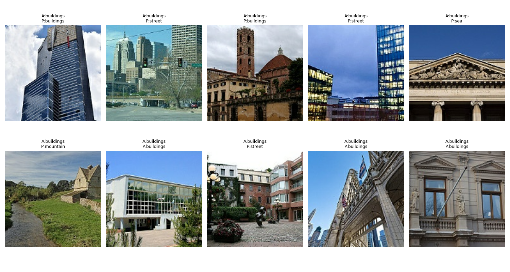
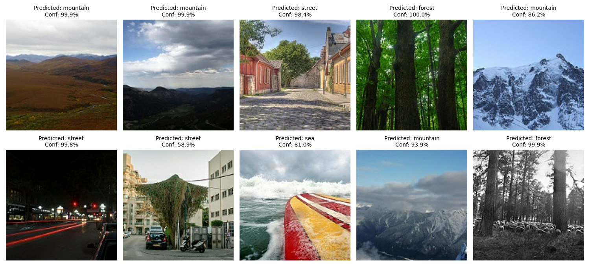

# Day 3

## NeuralNetworkProblem.py script generates the following outputs

  

  

  

## IntelImageClassification.py script generates the following outputs

  

  

  

  

  

  

### Also generates <b><i>intel_image_classifier.keras</i></b> which is used to Predict 

## Predict.py script generates the following outputs by using intel_image_classifier.keras

  

