# Day 4

## Compare Model Program 

### 🤖 Models Used

- Custom CNN (built from scratch using Conv2D layers)
- MobileNetV2 (transfer learning)
- ResNet50 (transfer learning)
- EfficientNetB0 (transfer learning)

### 📊 Dataset Used

- CIFAR-10 (CIFAR-10 dataset from TensorFlow/Keras)

### Output

  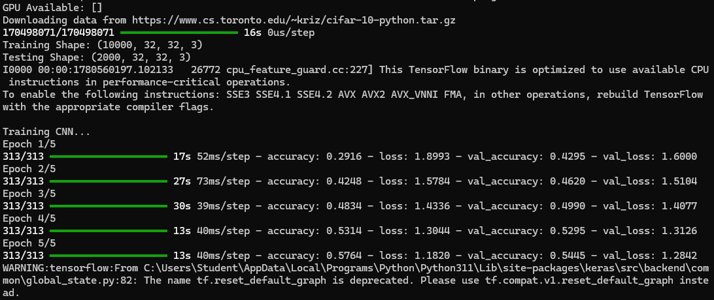

  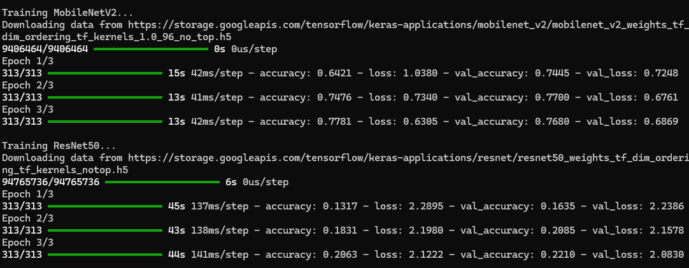

  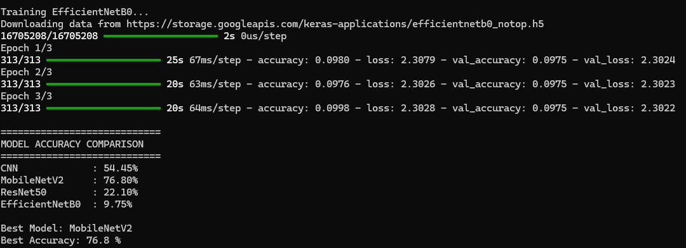

  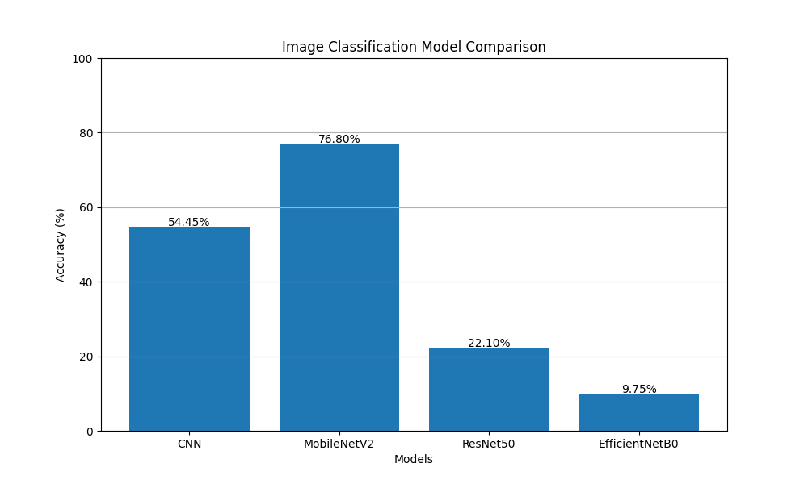

## Compare Model Dataset2 Program 

### 🤖 Models Used

- Custom CNN (built from scratch using Conv2D layers)
- MobileNetV2 (transfer learning using ImageNet weights)
- ResNet50 (deep residual network, transfer learning)
- EfficientNetB0 (efficient CNN architecture with transfer learning)

### 📊 Dataset Used

- Fashion-MNIST (fashion image dataset loaded via TensorFlow/Keras)

### Output

  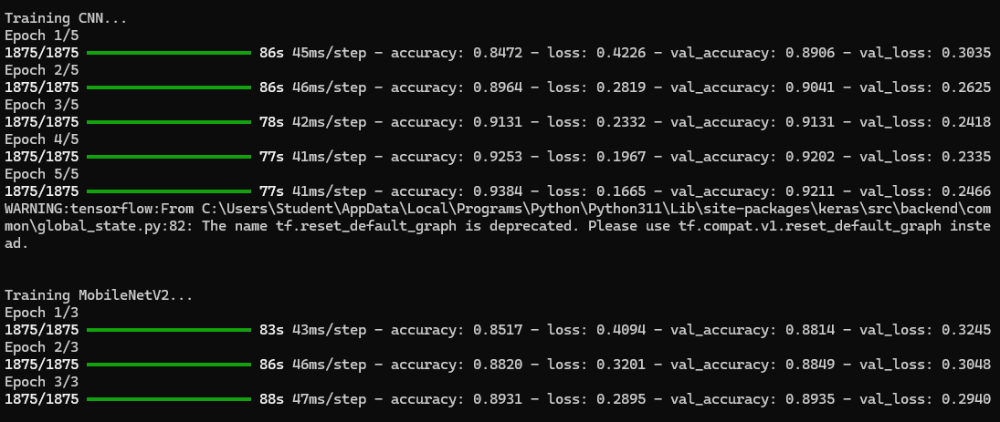

  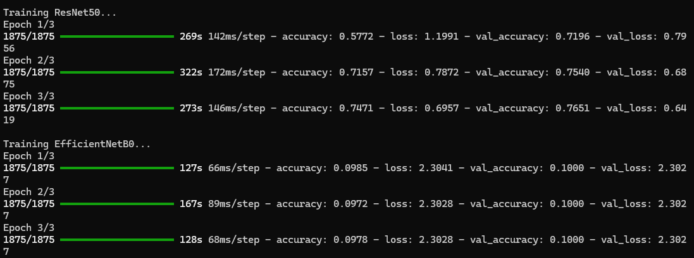

  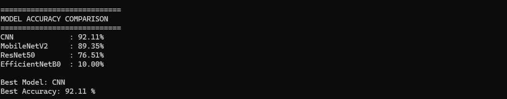

  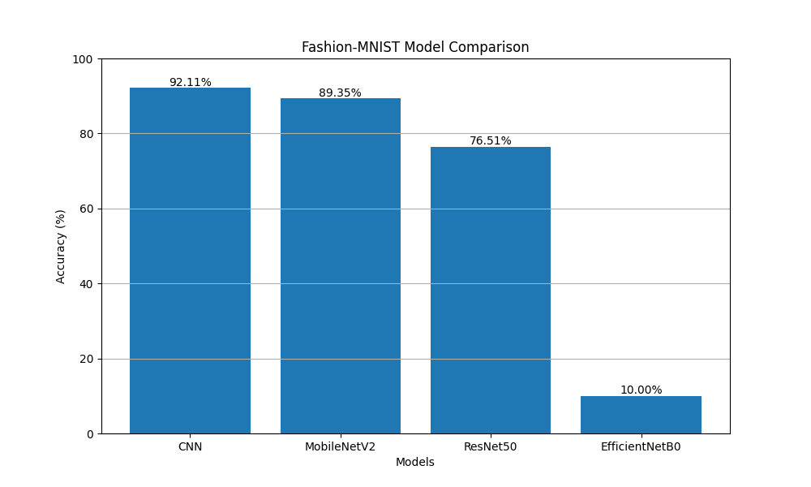

# Load Dataset Program 

### 🤖 Model Used

- None (Dataset loading and exploration only)

### 📊 Dataset Used

- PlantVillage (loaded from Hugging Face datasets library)

### Output

  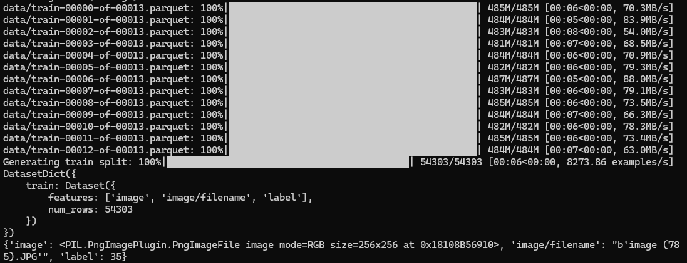

# Image Classification Using MobileNETV2 Program

### 🤖 Model Used

- MobileNetV2 (pretrained on ImageNet)
- Transfer Learning model with custom classification head
- Data augmentation applied (flip, rotation, zoom)

### 📊 Dataset Used

- Flower Photos Dataset (TensorFlow)
- 5 classes: daisy, dandelion, roses, sunflowers, tulips
- Used for image classification

### 🧪 Test Flower Used

  

### Output

  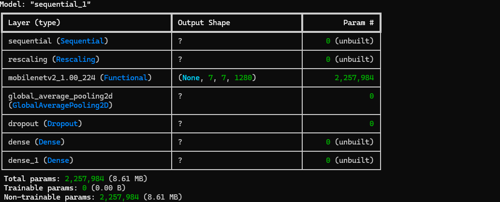

  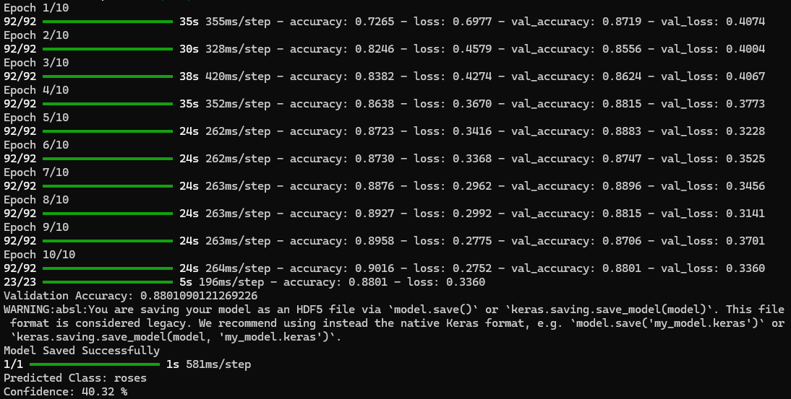

  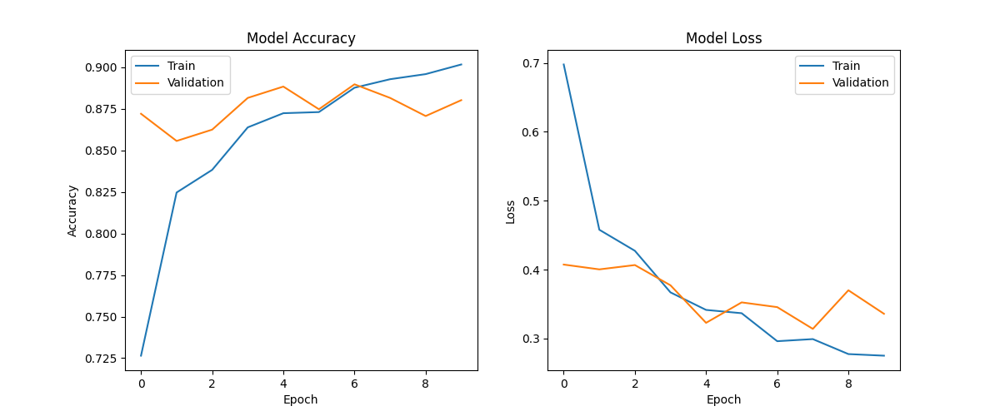

  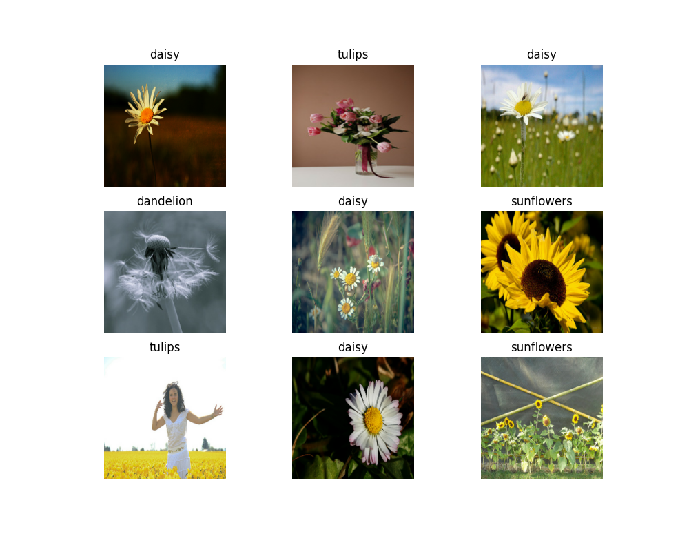

### Also generates <b><i>flower_classifier</i></b> which stores results after training 